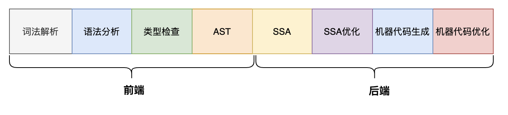
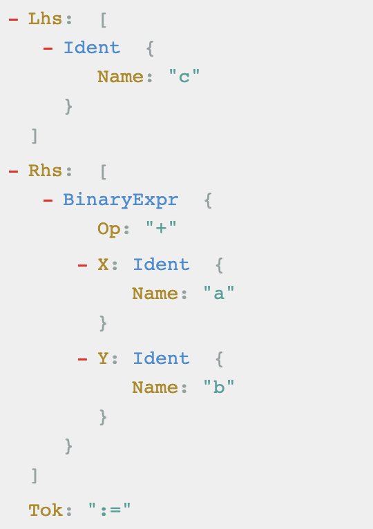
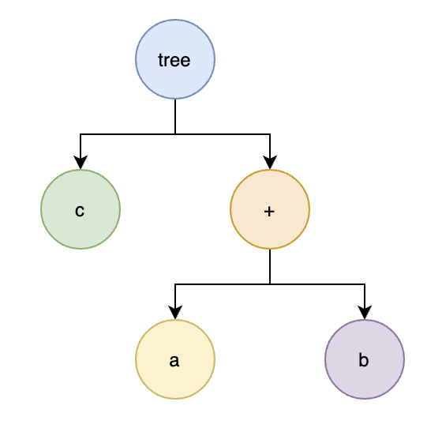

# GO编译流程

## 背景
GO属于静态语言，需要编译才能运行，因为计算机只能实别二进制机器码。GO编译过程分为前端和后端，编译前端主要有词法分析、语法分析、类型检查及语义分析，编译后端主要有中间码生成、代码优化及机器码生成。

## 预备知识
想了解编译过程，需要先了解一下编译过程的一些术语及专业知识。

## CPU架构

GO目前支持386、amd64、arm及arm64等CPU架构，这里简单介绍一下相关架构：

名称| 说明|
:---: | :----: |
arm|国ARM公司是全球领先的半导体知识产权（IP）提供商。全世界超过95%的智能手机和平板电脑都采用ARM架构
arm64 | 64位RISC微处理器
I386 | 是 80386 的那代 CPU 的标准，主要是支持 32 位的保护模式和实模式两种工作环境
mips | 是一种采取精简指令集（RISC）的处理器架构，是32位大端字节序，所属公司宣布将放弃继续设计MIPS架构，全身心投入RISC-V阵营
mipsle | 32位小端字节序
mips64 | 64位大端字节序
mips64le | 64位小端字节序
ppc64 | 是Linux和GCC开源软件社区内常用的，指向目标架构为64位PowerPC和Power Architecture处理
ppc64le | 是一个已经推出了纯小端模式，POWER8作为首要目标，OpenPower基金会基础的技术，试图使基于x86的Linux软件的移植工作以最小的工作量进行
riscv64 | 是一个基于精简指令集（RISC）原则的开源指令集构架（ISA），简易解释为开源软件运动相对应的一种「开源硬件」
s390x | IBM System z 系列 (zSeries)大型机 (mainframe) 硬件平台，是银行或者大型企业或者科研单位用的
wasm | 是一个可移植、体积小、加载快并且兼容 Web 的全新格式

wasm：编译GOOS=js GOARCH=wasm go build -o main.wasm

## 指令集

不同的系统及硬件指令集有可能不一样，这也是为什么go会针对不同的架构调用相应汇编代码，目前比较常见的指令集arm、x86等。

指令集分为精简指令和复杂指令集：

复杂指令集：通过增加指令的类型减少需要执行指令数。

精简指令集：使用更少的指令类型完成目标的计算任务。

Intel和AMD可以认为是CISC的典型代表。一条复杂的指令实现复杂的功能，对于编译器的要求低，只需一条指令就可以解决问题。ARM必须将数据加载到寄存器才能被指令使用,例如a+=b,复杂指令只需要一条指令，简单指令需要先加载再计算。

CISC(复杂)	数量多，使用频率差别大，可变长格式

RISC(精简)	数量少，使用频率接近，定长格式，大部分为单周期指令，load/store操作内存

CISC对CPU逻辑电路的设计要求高，简化了对编译器的要求，但是带来了CPU成本和功耗的增加。

RISC通过多条简单指令拼凑一个复杂功能，对编译器优化要求高，但是功耗低，CPU设计简单，主要用在端侧。

CISC指令长度不固定，指令较多，这将导致指令切割复杂，通常需要切割未多个微操作码，然后执行计算。

RISC指令长度固定，指令较少，指令码切割简单，这将更容易并行化，执行效率高。

## AST
抽象语法树（Abstract Syntax Tree)，是源代码结构的一种抽象表达方式，AST会删除源代码中不重要的一些空格、分号或者括号等相关字符。

例如：c := a + b,这里binaryExpr是指二元表达式

## SSA
静态单赋值（Static Single Assignment）是中间代码的特性，如果中间代码具有静态单赋值特性，那么每个变量只能会被赋值一次，SSA主要是对代码进行优化的。

下面代码x := 1不会起到任何作用：

x := 1

x := 2

y := x

# 目录

* 词法和语法分析

* 词法解析

* Token定义

* 源文件读取

* NextCh逻辑

* Fill逻辑

* Token解析

* DFA

* NFA

* 语法分析

* 自顶向下

* 最左推导

* 最右推导

* 自底向上

* 移入归约分析

* 文法

* 文法分类体系
* 0型文法
* 1型文法
* 2型文法
* 3型文法
* 二义性
* 文法分析
* 文法关键函数
* 文法分析模式
* LL(1)分析案例
* LALR分析案例
* Parser
* 文法定义
* 整体执行流程
* 文法函数
* got
* want
* importDecl
* constDecl
* typeDecl
* paramList
* paramDeclOrNil
* typeOrNil
* expr
* funcDeclOrNil
* funcStmt
* 类型检查
* 非泛型
* noder
* 执行流程
* typecheck
* OTARRAY
* OTMAP
* OMAKE
* 泛型
* 类型定义
* 数据结构
* 接口定义
* 基础类型
* 数组和切片
* 结构体
* 指针
* map
* chan
* type
* 函数
* interface
* 泛型
* 对象定义
* 数据结构
* 内部函数
* make
* Universe
* 对象收集
* ImportDecl
* 对象类型状态
* 类型循环引用
* 作用域
* 类型匹配
* 表达式
* Body Stmt
* 初始化对象顺序
* IR
* IR-Tree 数据结构
* Irgen结构体
* Node Interface
* miniNode结构体
* miniType 结构体
* miniExpr结构体
* miniStmt结构体
* Import
* 类型创建
* 泛型函数实例化
* 初始化任务
* 初始化方式
* 数据结构
* 执行步骤
* 清除无效代码
* 内联函数
* scc
* 内联检查
* 逃逸分析
* 静态数据流
* 数据结构
* 执行流程
* 创建顶点
* 创建边
* 逃逸分析
* SSA
* 场景
* 静态单赋值
* 优化算法
* 中间表示分类
* 线性IR
* 单地址应用场景
* 图IR
* 优势边界计算最小SSA
* 支配节点（dominator)）
* 支配节点树（dominator tree)
* 优势边界（Dominance Frontier）
* Ø函数生成
* 执行流程
* 模板生成中间代码
* 配置初始化
* Walk
* Compile SSA
* 中间代码优化
* 优化方法
* 删除无用代码
* 公共子表达式消除
* 常量合并
* 代码移动
* 活跃变量分析
* 机器码
* 寄存器分配 
* 线性扫描
* 图染色方法
* 指令调度
* 数据依赖图（DDG)
* 优先队列
* 堆栈分配
* 生成汇编
* ELF
* 生成机器码

